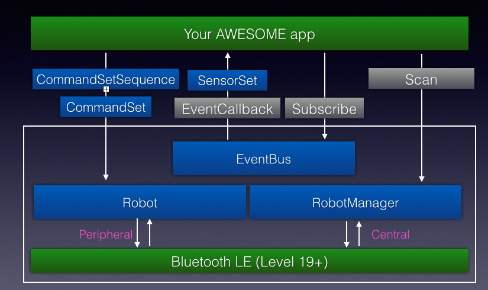

# Introduction to the Android API

Welcome to the Wonder Workshop API documentation!  In this guide, you will learn to:

* Integrate with the API package through our API installation guide.
* Discover and connect to Wonder Workshop robots as described in the <a data-ng-click="scrollTo('establishrobotconnection')">Establish robot connection</a> section.
* <a data-ng-click="scrollTo('issuerobotcommands')">Issue robot commands</a>, such as moving forward or backward.
* Enable the robot to react to certain events, such as a clapping sound or a shaking motion, in the <a data-ng-click="scrollTo('registerrobotgestureevents')">Register robot events</a> section. 

## Quickstart

* For full API documentation, please check out [developer docs](./doc/index.html) section.
* For a quickstart guide, please refer to [getting started guide](./getting-started-android.md) section.
* Please check out our [sample application](https://github.com/playi/playground) for more examples (Note: you will need to provide your github screen name to developers@makewonder.com for approval before access as our developer program is currently in closed beta).

# API Architecture

The API has 6 major components:

* Robot: this class represents a physical robot to which you can execute commands and from which you can receive sensor data.  Please refer to the <a data-ng-click="scrollTo('issuerobotcommands')">Issue robot commands</a> and <a data-ng-click="scrollTo('registerforrobotevents')">Register for robot events</a> sections for how to interact with dash and dot.
* RobotManager: this class manages the discovery and connection of Wonder Workshop robots.  Please refer to <a data-ng-click="scrollTo('establishrobotconnection')">Establish robot connection</a> for how use this class.
* EventBus: this is the event notification architecture for the API.
* CommandSet: this class represents the command(s) to be sent to the robot.
* CommandSetSequence: this class contains an ordered list of CommandSet objects that should be executed serially by the robot.
* SensorSet: this class represents the sensor data from the robot during a snapshot in time.  Robots will report new sensor data roughly every 30ms, depending on signal strength.
* GestureEvent: this is a marker interface for all robot related events published by the API. 

Here is a diagram of the API architecture: 
</img>

# Establish robot connection

Before issuing commands or receiving robot sensor data, we need to discover and connect to the Wonder Workshop robots.  The _RobotManager_ class handles all heavy lifting by making it easy to:

- Scan for Wonder Workshop robots that are available
- Establish a connection to a robot (and disconnect from it)
- Caching known robots and their connection statuses

All of these actions above are asynchronous and results are handled by registering on the EventBus to be notified for the appropriate event types.

## Scan for Wonder Workshop robots

Before attempting to make a connection to the robots, we have to first discover if they are within connection range.  Users can either choose to do a one time scan or a periodic scan, and will handle the discovery part via the systemBus channel:

```java
public class MyClass {

  public void someMethod() { 
    android.content.Context context = ... // -- Get an Android application context instance
    // obtain a manager class
    RobotManager manager = RobotManagerFactory.getRobotManager(context);

    // register for scan and robot connect/disconnect events
    EventBus systemBus = EventBusFactory.getSystemBus();
    systemBus.register(this);

    // periodically scan every 2 seconds.  if <= 0, then it will be a one time scan
    manager.startPeriodicScan(2, java.util.concurrent.TimeUnit.SECONDS);
  }

  // when robot is discovered, an event will be emitted.  implment onEvent (or onEventMainThread) method to handle RobotScannedEvent
  public void onEvent(RobotScannedEvent event){
    Robot robot = event.getRobot();
    Log.i("discovered robot: " + robot.getName());
  }
}
```


## Connect with Wonder Workshop robot

After you discover the robot, you can choose to connect to it (usually based on some identifiable information on the robot). An event will be published indicating the result of the connection attempt. For example:

```java
...
androit.content.Context context = ... // -- Get an Android application context
Robot robot = manager.getRobot(robotId);

robot.connect(context);  // assumed that you have already registered with the SystemBus already

// if successfully connected
public void onEvent(RobotConnected event) {
  Robot robot = event.getRobot();
  Log.i("connected with robot: %s, robot.getName());
}

// if connection failed
public void onEvent(RobotConnectionFailed event) {
  Robot robot = event.getRobot();
  Log.e(TAG, "Failed to connect to robot: " + robot.getName(), event.getCause());
}
```

## Disconnect from the robot

Disconnecting from a known robot is very easy; again the result will be broadcast as an event

```java

// try to disconnect, assuming you've already registered with the SystemBus already
robot.disconnect()

// in delegate implementation
public void onEvent(RobotDisconnected event) {
  Log.i("Robot disconnected: " + event.getRobot().getName());
}
```

# Register for event notification

As you have seen in the <a data-ng-click="scrollTo('establishrobotconnection')">establish robot connections</a> section, all async calls in the API are delivered by our event bus architecture.  Our API relies on the (GreenRobot EventBus)[https://github.com/greenrobot/EventBus] for publishing all of our events, and there are two different types of event buses:

* System event bus: publishes "system" level events that applies across all robots. These include discovery of new robots and all robot connection related events (e.g. connect, disconnect and connection failure). 
* Robot event bus: each robot has its own private event bus that it uses to publish important events about itself. This includes updates to sensor events received, CommandSetSequence execution events, and <a data-ng-click="scrollTo('registerrobotgestureevents')">custom defined gesture events</a>.

Note: EventBus retains a pointer to any registered listener on the global scope, which means you should unregister from eventBus if your class goes out of scope, otherwise it will never be GC'ed by the JVM.

Below is a quick sample code on how to register/unregister from our event bus system.

```java
this.mListener = ... ; // the class that will handle the events
this.mSystemBus = EventBusFactory.getSystemBus();
this.mSystemBus.register(this.mListener); // handle system bus events
this.mRobotBus = EventBusFactory.getRobotEventBus(robot.getRobotId());
this.mRobotBus.register(this.mListener); // handle specific robot events

// do stuff

// before your class goes out of scope, make sure to unregister from event bus
this.mSystemBus.unregister(this.mListener);
this.mRobotBus.unregister(this.mListener);
```

# Issue robot commands

Before issuing any robot commands, make sure you first understand how to <a data-ng-click="scrollTo('establishrobotconnection')">establish robot connections</a>.

Once you have established connection with the robot, you can make it do what you want (within reason, of course) with the use of RobotCommandSet! The following are the classes for issuing a robot command:

* _Robot_: this class has a 1-to-1 mapping to the actual Wonder Workshop robot and handles the logic sending the command itself.    
* _RobotCommandSet_: the class is a key-value pair container class that user will use to issues a set of commands to the robot.  If user tries to populate it with a sensory component, such value will simply be ignored at send time. 


## Sending a command set

A command set can contain 1 or more commands. For example, if you want the robot ears to turn red:

```java
RobotCommandSet earsRed = RobotCommandSet.emptySet();
LightRGB red = new LightRGB(1, 0, 0);
earsRed.addCommandLeftEarLight(red);
earsRed.addCommandRightEarLight(red);
robot.sendCommandSet(earsRed);
```


# Executing a command sequence

A command sequence is a powerful tool that can be used to execute a complex series of robot actions; its design is similar to animated sequences since it contains a list of ordered action frames.  For example, a complex robot action such as wiggle (involes robot rotating left and right in a timed manner) can be expressed by a single CommandSetSequence object.

## A simple robot action example

In order to make the robot wiggle, it is a chain of timed movements where the robot rotates left and right a few times.  So let's do this programmatically:

```java
// create the sequence object   
CommandSetSequence wiggle = new CommandSetSequence();

// create left step and right step
RobotCommandSet rotateLeft = RobotCommandSet.emptySet();
rotateLeft.addCommandBodyWheels(new BodyWheels(-20, 20));
RobotCommandSet rotateRight = RobotCommandSet.emptySet();
rotateLeft.addCommandBodyWheels(new BodyWheels(20, -20));

// add the commands to have a 2 second wiggle
wiggle.addCommandSet(0.5, rotateLeft);
wiggle.addCommandSet(0.5, rotateRight);
wiggle.addCommandSet(0.5, rotateLeft);
wiggle.addCommandSet(0.5, rotateRight);

// register for robot events
EventBus robotBus = EventBusFactory.getRobotEventBus(robot.getRobotId());
robotBus.register(this);

robot.startCommandSetSequence(wiggle); 

// sequence finished execution
public void onEvent(RobotCommandSetSequenceFinished event) {
  Robot robot = event.getRobot();
  CommandSetSequence sequence = event.getSequence();
  Log.i("finished executing sequence!");
}

// sequence was cancelled
public void onEvent(RobotCommandSetSequenceStopped event) {
  Robot robot = event.getRobot();
  CommandSetSequence sequence = event.getSequence();
  Log.i("sequence was cancelled!");
}
```

Another way to do this is to express this through file content.  The API is designed to parse through JSON-formatted content and generate a WWCommandSetSequence from it.  Here is wiggle, expressed in a file (demo.json):

```json
{
  "data": [
    {
      "duration": 0.5,
      "commands": {
        "211": {
          "left_cm_s": -20,
          "right_cm_s": 20
        }
      }
    },
    {
      "duration": 0.5,
      "commands": {
        "211": {
          "left_cm_s": 20,
          "right_cm_s": -20
        }
      }
    },
    {
      "duration": 0.5,
      "commands": {
        "211": {
          "left_cm_s": -20,
          "right_cm_s": 20
        }
      }
    },
    {
      "duration": 0.5,
      "commands": {
        "211": {
          "left_cm_s": 20,
          "right_cm_s": -20
        }
      }
    }
  ]
}
```

Here is how you would load the file in programmatically:

```java
String json = ...; // load the file into this json string
CommandSetSequence  wiggle = new CommandSetSequence();
wiggle.fromJson(new JSONObject(json));
robot.startCommandSetSequence(wiggle); // assume you've registered the relevant events

```

# Register robot gesture events
Before you start registering for gesture events, please read <a data-ng-click="scrollTo('registerforeventnotification')">register for event notification</a> section to understand our event notification architecture.

Aside from default system (discovery/connect/disconnect) and robot specific (SensorSet data, CommandSetSequence execution status, etc) events that API emit by default, the API also allows callers to register for custom events!  

Gesture events are very powerful and the API comes pre-packaged with a common set of events that are frequently used. Please look at GestureEventFactory for details.

## Registering for a pre-defined event

The Wonder Workshop API has a set of commonly used events that you can use right away.  Here is an example of turning dash's ears to red when it detects something in front.

```java
CommandSet earsRed; // assume this is already setup

// register the desired event, assuming this class is already listening to the robot bus
robot.subscribeEvent(GestureEventFactory.detectObjectFront(60, robot));

// handle event callback
public void onEventBackgroundThread(GestureEvent event) 
{
  String identifier = event.getIdentifier();
  if (identifier.equals(GestureEventFactory.OBJECT_IN_FRONT_GESTURE_EVENT)) {
    robot.sendCommandSet(earsRed);
  }
}
```

## Define custom events

Of course, you can define your own custom events as well.  Since event bus uses reflection, you can pretty much define your own event and trigger it accordingly.

```java
// define my custom event
String eventId = "my_awesome_event";
GestureEvent myAwesomeEvent = new GestureEvent(eventId, robot, new GestureEventHandler() {
  @Override
  public boolean shouldAlert(GestureEvent event, RobotSensorHistory history) {
    return true; // this awesome event will always be triggered since it is true
  }  
});

// register with robot (need to also listen to robot bus)
robot.subscribeEvent(myAwesomeEvent);

// handle event callback
public void onEventBackgroundThread(GestureEvent event) 
{
  if (identifier.equals(eventId)) {
    // do something
  }
}
```

> Note: These events will be evaluated **every time** robot state information is received, so please make sure the time it takes to determine if an event should be triggered is fast (< 2ms processing time).  If an event takes too long to decide, its result will be ignored. 

## Remove a event

If you are no longer interested in a specific event, you can choose to remove it.

```java
[robot unsubscribeEvent:myAwesomeEvent]; 
```

