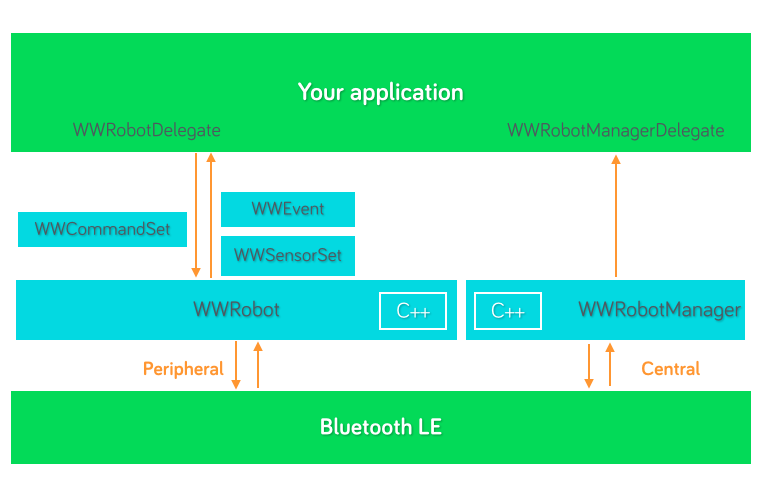

# Introduction to the iOS API

Welcome to the Wonder Workshop API documentation!  In this guide, you will learn to:

* Integrate with the API package through our API installation guide.
* Discover and connect to Wonder Workshop robots as described in the <a data-ng-click="scrollTo('establishrobotconnection')">Establish robot connection</a> section.
* <a data-ng-click="scrollTo('issuerobotcommands')">Issue robot commands</a>, such as moving forward or backward.
* Enable the robot to react to certain events, such as a clapping sound or a shaking motion, in the <a data-ng-click="scrollTo('registerrobotevents')">Register robot events</a> section. 

## Quickstart

* For full API documentation, please check out [developer docs](./doc/index.html) section.
* For a quickstart guide, please refer to [getting started guide](./getting-started-ios.md) section.
* Please check out our [sample application](https://github.com/playi/playground) for more examples (Note: you will need to provide your github screen name to developers@makewonder.com for approval before access as our developer program is currently in closed beta).

# API Architecture

The API has 5 major components:

* WWRobot: this class represents a physical robot to which you can execute commands and from which you can receive sensor data.  Please refer to the <a data-ng-click="scrollTo('issuerobotcommands')">Issue robot commands</a> and <a data-ng-click="scrollTo('registerrobotevents')">Register robot events</a> sections for how to interact with dash and dot.
* WWRobotManager: this class manages the discovery and connection of wonder workshop robots.  Please refer to <a data-ng-click="scrollTo('establishrobotconnection')">Establish robot connection</a> for how use this class.
* WWCommandSet: this class represents the command(s) to be sent to the robot.
* WWCommandSetSequence: this class contains an ordered list of WWCommandSet objects that should be executed serially by the robot.
* WWSensorSet: this class represents the sensor data from the robot during a snapshot in time.  Robots will report new sensor data roughly every 30ms, depending on signal strength.
* WWEvent: this class acts as the notification mechanism for our robots from which you want to receive alerts.


Here is a diagram of the API architecture: 
</img>

# Establish robot connection

Before issuing commands or receiving robot sensor data, we need to discover and connect to the Wonder Workshop robots.  The _WWRobotManager_ singleton class handles all heavy lifting by making it easy to:

- Scan for Wonder Workshop robots that are available
- Establish a connection to a robot (and disconnect from it)
- Caching known robots and their connection statuses

All of these actions above asynchronous and results are handled by *WWRobotManagerDelegate*.

## Scan for Wonder Workshop robots

Before attempting to make a connection to the robots, we have to first discover if they are within connection range.  Users can either choose to do a one time scan or a periodic scan, and will handle the discovery part in the delegate similarly to the following:

```objectivec
// obtain singleton manager class
WWRobotManager *manager = [WWRobotManager manager];
// set delegate to handle callback
manager.delegate = self;
// periodically scan every 2 seconds.  if <= 0, then it will be a one time scan
[manager startScanningForRobots:2.0f];

// in the delegate implementation
- (void) manager:(WWRobotManager *)manager didDiscoverRobot:(WWRobot *)robot
{
    NSLog(@"discovered robot: %@", robot.name);
    [manager connectToRobot:robot];
}
```


## Connect with Wonder Workshop robot

After you discover the robot, you can choose to connect to it (usually based on some identifiable information on the robot). The delegate will handle success or failure conditions. For example:

```objectivec
// try to establish connection
[manager connectToRobot:robot]; 

// if successfully connected
- (void) manager:(WWRobotManager *)manager didConnectRobot:(WWRobot *)robot
{
    NSLog(@"connected with %@, status: %d", robot.name, robot.connectionStatus);
    // set the robot delegate
    robot.delegate = self;
    // start sending commands to the robot!
}

// if connection failed
- (void) manager:(WWRobotManager *)manager didFailToConnectRobot:(WWRobot *)robot error:(WWError *)error
{
    NSLog(@"failed to connect to robot: %@, with error: %@", robot.name, error);
}
```

## Disconnect from the robot

Disconnecting from a known robot is very easy; the result will be handled by the delegate:

```objectivec
// try to disconnect
[manager disconnectFromRobot:kevinBot];

// in delegate implementation
- (void) manager:(WWRobotManager *)manager didDisconnectRobot:(WWRobot *)robot
{
    NSLog(@"successfully disconnected from %@", robot.name);
}
```

# Issue robot commands

Before issuing any robot commands, make sure you first understand how to <a data-ng-click="scrollTo('establishrobotconnection')">establish robot connections</a>.

Once you have established connection with the robot, you can make it do what you want (within reason, of course) with the use of command set! The following are the classes for issuing a robot command:

* _WWRobot_: this class has a 1-to-1 mapping to the actual Wonder Workshop robot and handles the logic sending the command itself.    
* _WWCommandSet_: the class is a key-value pair container class that user will use to issues a set of commands to the robot.  If user tries to populate it with a sensory component, such value will simply be ignored at send time. 

<aside class="notice">
    Note: The API comes pre-packaged with a common set of commands that are frequently used.  Please see WWCommandToolbelt.h for details. 
</aside>


## Sending a command set

A command set can contain 1 or more commands. For example, if you want the robot ears to turn red:

```objectivec 
WWCommandSet *earsRed = [WWCommandSet new];
[earsRed setLeftEarLight:[[WWCommandLightRGB alloc] initWithRed:1.0 green:0 blue:0]];
[earsRed setRightEarLight:[[WWCommandLightRGB alloc] initWithRed:1.0 green:0 blue:0]];    
[robot sendRobotCommandSet:earsRed];
```


# Executing a command sequence

A command sequence is a powerful tool that can be used to execute a complex series of robot actions; its design is similar to animated sequences since it contains a list of ordered action frames.  For example, a complex robot action such as wiggle (involes robot rotating left and right in a timed manner) can be expressed by a single WWCommandSetSequence object.

## A simple robot action example

In order to make the robot wiggle, it is a chain of timed movements where the robot rotates left and right a few times.  So let's do this programmatically:

```objectivec
// create the sequence object   
WWCommandSetSequence *wiggle = [WWCommandSetSequence new];

// create left step and right step
WWCommandSet *rotateLeft = [WWCommandSet new];
[rotateLeft setBodyWheels:[[WWCommandBodyWheels alloc] initWithLeftWheel:-20.0 rightWheel:20.0]];
WWCommandSet *rotateRight = [WWCommandSet new];
[rotateRight setBodyWheels:[[WWCommandBodyWheels alloc] initWithLeftWheel:20.0 rightWheel:-20.0]];

// add the commands to have a 2 second wiggle
[wiggle addCommandSet:rotateLeft withDuration:0.5];
[wiggle addCommandSet:rotateRight withDuration:0.5];
[wiggle addCommandSet:rotateLeft withDuration:0.5];
[wiggle addCommandSet:rotateRight withDuration:0.5];
[robot executeCommandSequence:wiggle withOptions:nil];

// in WWRobotDelegate
- (void) robot:(WWRobot *)robot didStopExecutingCommandSequence:(WWCommandSetSequence *)sequence withResults:(NSDictionary *)results
{
    // triggered when a sequence is manually stopped
}
- (void) robot:(WWRobot *)robot didFinishCommandSequence:(WWCommandSetSequence *)sequence
{
    // triggered when a sequence is finished
}
```

Another way to do this is to express this through file content.  The API is designed to parse through JSON-formatted content and generate a WWCommandSetSequence from it.  Here is wiggle, expressed in a file (demo.json):

```json
{
  "data": [
    {
      "duration": 0.5,
      "commands": {
        "211": {
          "left_cm_s": -20,
          "right_cm_s": 20
        }
      }
    },
    {
      "duration": 0.5,
      "commands": {
        "211": {
          "left_cm_s": 20,
          "right_cm_s": -20
        }
      }
    },
    {
      "duration": 0.5,
      "commands": {
        "211": {
          "left_cm_s": -20,
          "right_cm_s": 20
        }
      }
    },
    {
      "duration": 0.5,
      "commands": {
        "211": {
          "left_cm_s": 20,
          "right_cm_s": -20
        }
      }
    }
  ]
}
```

Here is how you would load the file in programmatically:

```objectivec
WWCommandSetSequence *wiggle = [WWCommandSetSequence sequenceFromFileInBundle:@"demo" fileType:@"json"];
[robot executeCommandSequence:wiggle withOptions:nil];

```

# Register Robot Events

Before you can register for any robot events, please make sure you first understand how to <a data-ng-click="scrollTo('establishrobotconnection')">establish robot connections</a>.

Once you are connected to a Wonder Workshop robot, it will start to stream state information (roughly every 30ms).  At any given time, you can register for (or remove) any pre-defined or custom events and handle them in the _WWRobotDelegate_ class.    

Here are all the classes that are involved for registering a robot event:
* _WWRobot_: this class has a 1-to-1 mapping to the actual Wonder Workshop robot and handles the logic of invoking registered events to see if a callback should be triggered.
* _WWSensorSet_: this class represents a set of robot's _actual_ sensory data at a given timestamp. WWEvent uses the sensor set information to determine if an event needs to be triggered, and sensor information is updated roughly every 30ms (pending signal strength).
* _WWEvent_: this class allows user to register a trigger for a desired situation based on the latest robot sensor set data.  

Note: The API comes pre-packaged with a common set of events that are frequently used. Please look at WWEventToolbelt.h for details.

## Registering for a pre-defined event

The Wonder Workshop API has a set of commonly used events that you can use right away.  Here is an example of turning the robot ears to red when the main button is pressed down, but off otherwise. 

```objectivec
WWCommandSet *earsRed; // assume this is already setup
WWCommandSet *earsOff; // assume this is already there as well

// register events to robot
WWEvent *mainButtonOnTouchDown = [WWEventToolbelt buttonOnDown:[NSNumber numberWithUnsignedInteger:WW_SENSOR_BUTTON_MAIN]];
WWEvent *mainButtonOnTouchUp = [WWEventToolbelt buttonOnUp:[NSNumber numberWithUnsignedInteger:WW_SENSOR_BUTTON_MAIN]];
[robot addEvent:mainButtonOnTouchDown];
[robot addEvent:mainButtonOnTouchUp];

// in delegate implementation
- (void) robot:(WWRobot *)robot eventsTriggered:(NSArray *)events
{
    for (WWEvent *event in events) {
        if ([event isEqual:mainButtonOnTouchDown]) {
            [robot sendRobotCommandSet:earsRed]; 
        }
        else if ([event isEqual:mainButtonOnTouchUp]) {
            [robot sendRobotCommandSet:earsOff];
        }
    }
}
```

## Define custom events

Of course, you can define your own custom events as well.  There are two ways to do this.  The quickest way is to initialize a WWEvent object and leverage the block logic to determine when to trigger an event:

```objectivec
WWEvent *customEvent = [[WWEvent alloc] initWithShouldAlertBlock:^BOOL(WWEvent *event, WWSensorHistory *history) {
    PIRobotState *currentState = history.currentState;
    PIRobotState *threeStatesAgo = [history pastStateAtIndex:3];
    // do your detection logic here
    return YES; // return YES when you want the event to trigger, NO otherwise.
} identifier:@"custom_event"];

[robot addEvent:customEvent]; // register the event
```

> Another way is to define your own WWEvent class:

```objectivec
// in MyAwesomeEvent.h, inherit from PIEvent 
@interface MyAwesomeEvent : PIEvent
    // any custom methods/properties
@end

// in MyAwesomeEvent.m, override the setup method with your own block
@implementation PIEvent
- (void) setup
{
    // make sure you call PIEvent setup first
    [super setup];
    // if you do not define this, it is defaulted to the class name in CamelCase
    self.identifier = @"MyAwesomeEvent";

    // if you do not define the shouldAlertBlock, this event is essentially a no-op (will never be triggered).
    self.shouldAlertBlock = ^BOOL(WWEvent *event, WWSensorHistory *history) {
        // your event logic to determine if event is satisfied or not
    };
}
@end
```

> Note: These events will be evaluated **every time** robot state information is received, so please make sure the time it takes to determine if an event should be triggered is fast (< 2ms processing time).  If an event takes too long to decide, its result will be ignored. 

## Remove a event

If you are no longer interested in a specific event, you can choose to remove it. You can remove it in two ways:

```objectivec
// using the event object itself (comparison using the isEqual: method)
[robot removeEvent:myAwesomeEvent]; 

// use the event identifier (comparison will use isEqualToString: method, which is case-sensitive)
[robot removeEventWithIdentifier:@"MyAwesomeEvent"];
```
