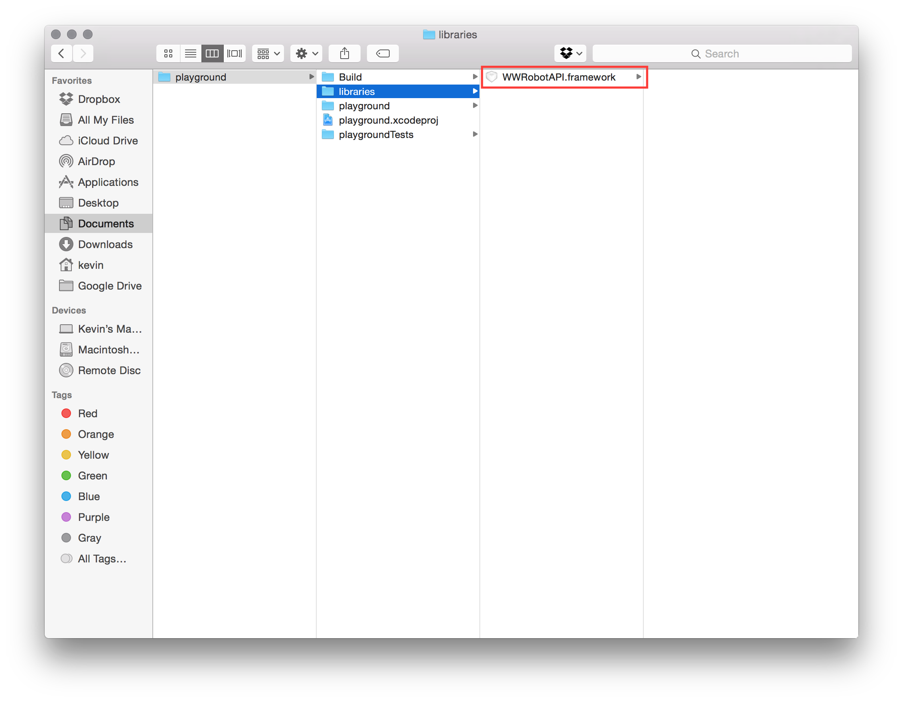
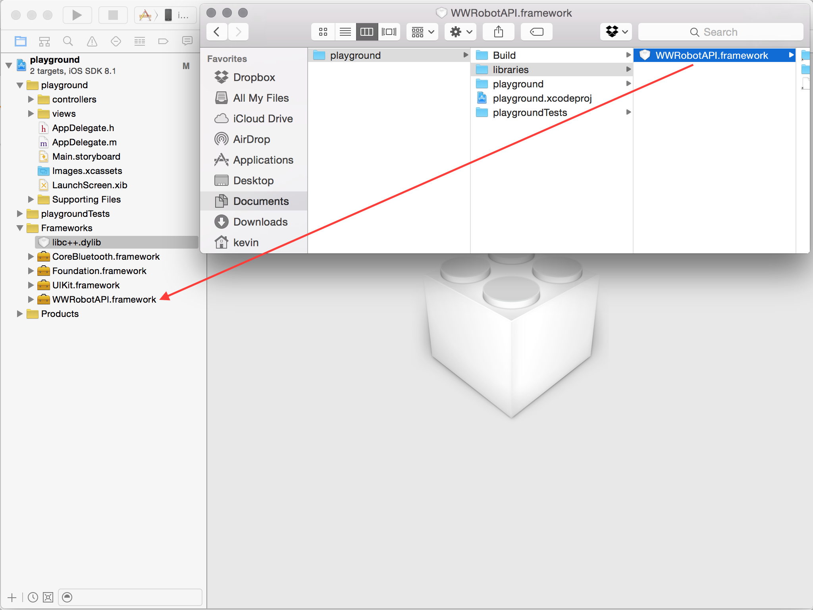
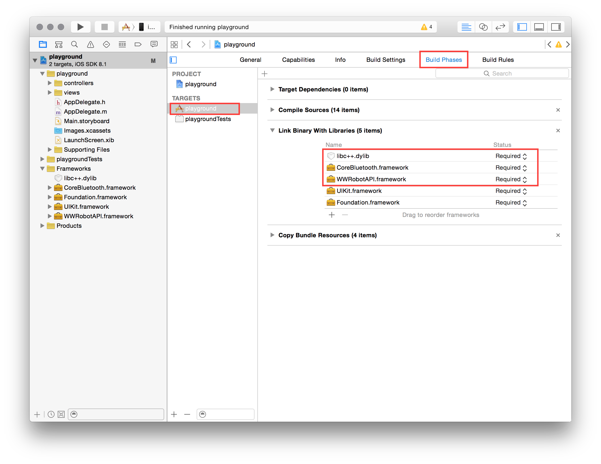
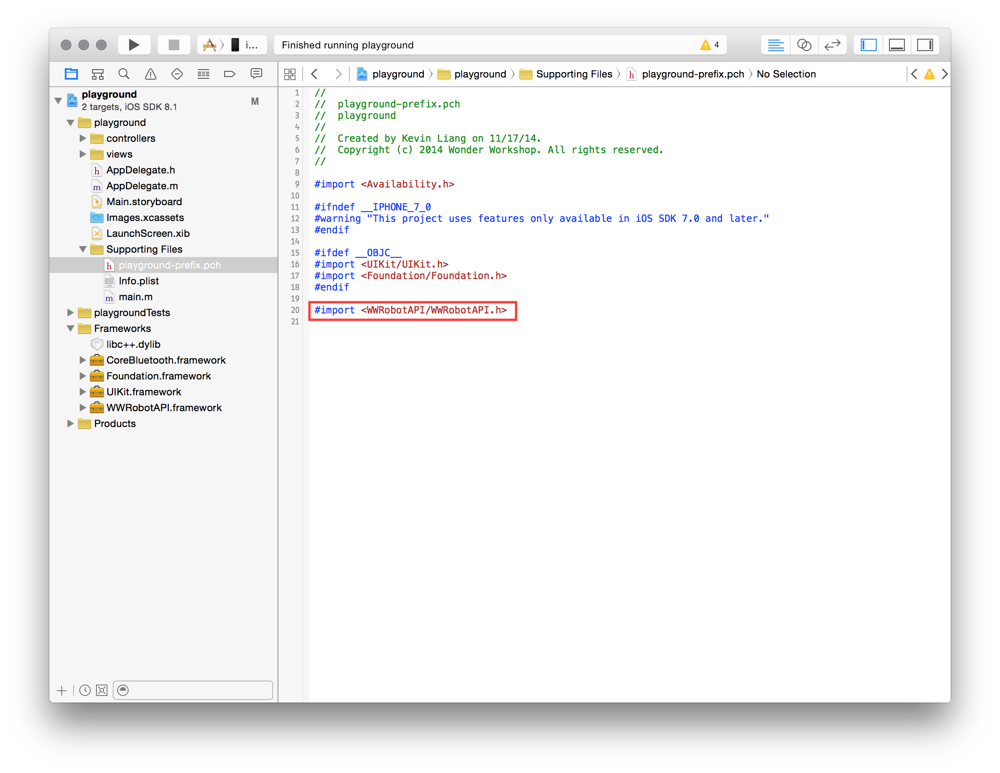

# Follow these steps to start building apps for Dash & Dot in minutes.

The Wonder Workshop API is currently packaged as an iOS static library. It is compatible with iOS 7+ on iPad 3 or <br />newer, iPad Mini, iPhone 4s or newer, and iPod (5th Gen).

## Prerequisites

* OS X is required for all iOS development.
* Xcode. If you don't have it, you can get it from the App Store.
* Dash and/or Dot robot. If you don't have one, you can order one from [our store](https://store.makewonder.com/).
* Supported Bluetooth 4 / Smart-enabled iOS v7.1+ or Android v4.3+ device are. See [here](https://www.makewonder.com/compatibility) for the full list.

---

### 1. Find our WWRobotAPI.framework static library in the folder `libraries`.

&nbsp;

### 2. Drop the library into your project.

> In our example, the framework is stored in the "libraries" folder under the Documents directory.

</img>


### 3. Add the API framework as a reference to your project (do not copy the files).

</img>

### 4. Add the following libraries into your project and in your build target's build phase.

</img>

### 5. Append this line to your prefix header file so that the Wonder Workshop API is available for the entire project. All the relevant header files are referenced in `WWRobotAPI.h`.

> This will only run on an iOS devices with Bluetooth LE, and will error out on XCode's iOS simulator or an older generation iPhone/iPad/iPod.

```objectivec
#import <WWRobotAPI/WWRobotAPI.h>
```

</img>

### 6. Start hacking!

That is it, go ahead and start programming with your very own dash or dot, or run our [sample application](https://github.com/playi/playground) to see the robots in action.  Please let us know at [developers@makewonder.com](mailto:developers@makewonder.com) when you've built cool integrations with our robots, we would love to know! 
